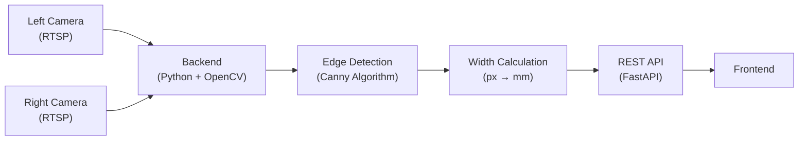
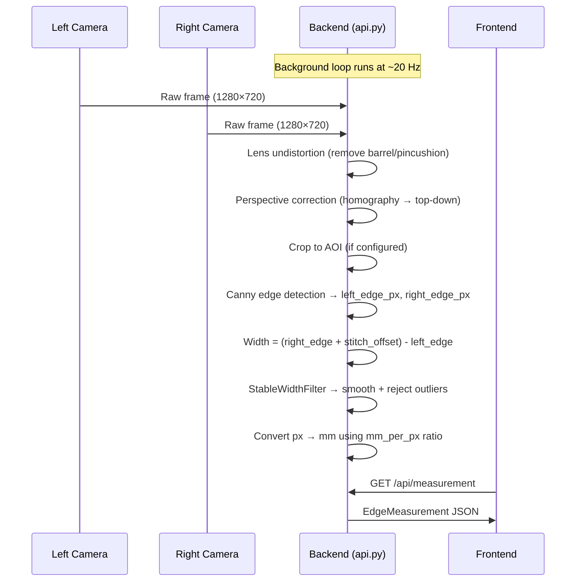
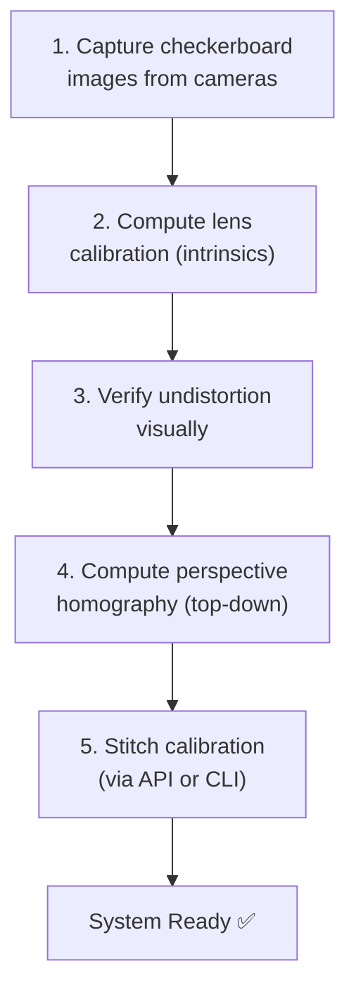

# Fabric Edge Detection System

> **Real-Time Fabric Width Measurement using Dual RTSP Cameras**  
> **Stack**: Python 3.11 · FastAPI · OpenCV · NumPy  
> **API Base URL**: `http://<server-ip>:8000`

---

## 1. What This System Does

An **industrial computer vision system** that measures fabric width in real-time using **two RTSP IP cameras** positioned at opposite edges of a fabric roll on a production line.

### The Core Problem

A moving fabric roll passes through a machine. Operators need to know the **exact width in millimeters** continuously to detect defects, alignment drift, or roll changes.

### How It Works (High-Level)



1. Two cameras capture the **left and right edges** of the fabric
2. Each frame is undistorted (lens correction) and perspective-corrected (top-down view)
3. Canny edge detection finds the fabric edge in each frame
4. The two edge positions are combined to compute total width
5. Width is stabilised (smoothed, outliers rejected) and converted to millimeters
6. Results are exposed via the REST API

---

## 2. Project Structure

```
edge-detection/
├── main.py                    # Original CLI application (OpenCV GUI)
├── calibrate.py               # Camera calibration utility (lens + perspective)
├── api.py                     # ⭐ FastAPI server — frontend integration point
├── calibration_data/
│   ├── left_calib.json        # Left camera lens distortion coefficients
│   ├── right_calib.json       # Right camera lens distortion coefficients
│   ├── left_homography.json   # Left camera perspective transform matrix
│   ├── right_homography.json  # Right camera perspective transform matrix
│   └── stitch_offset.json     # Dual-camera stitch calibration offset
└── calibration_images/        # Saved checkerboard images for calibration
    ├── left/
    └── right/
```

---

## 3. Quick Start

### Prerequisites

```bash
pip install fastapi uvicorn opencv-python numpy
```

### Running the API Server

```bash
# Start the server
uvicorn api:app --host 0.0.0.0 --port 8000

# With auto-reload for development
uvicorn api:app --host 0.0.0.0 --port 8000 --reload

# Or run directly
python api.py
```

### Interactive API Docs

Once running, visit:
- **Swagger UI**: `http://localhost:8000/docs`
- **ReDoc**: `http://localhost:8000/redoc`

### Running the CLI Application (no API)

```bash
python main.py --left-src rtsp://172.32.0.94:554/live/0 --right-src rtsp://172.32.0.93:554/live/0
```

### Environment Variables

| Variable | Default | Description |
|---|---|---|
| `LEFT_CAM_SRC` | `rtsp://172.32.0.94:554/live/0` | Left camera RTSP URL |
| `RIGHT_CAM_SRC` | `rtsp://172.32.0.93:554/live/0` | Right camera RTSP URL |

> **Note:** The API server starts the cameras on boot. It takes ~2 seconds for cameras to initialise. The `/api/measurement` endpoint will return `503` until the first measurement is ready.

---

## 3.1 Luckfox Board Setup (CLI)

Each Luckfox Pico board runs an RTSP camera server. Before the detection system can receive frames, the boards must be started with the correct pipeline commands.

### Board IP Addresses

| Board | IP Address | Role |
|---|---|---|
| **Left Camera** | `172.32.0.94` | Left edge of fabric |
| **Right Camera** | `172.32.0.93` | Right edge of fabric |

### SSH Into a Board

```bash
# Left camera board
ssh root@172.32.0.94

# Right camera board
ssh root@172.32.0.93
```

### Start the Camera Pipeline

Run these commands **on each board** after SSH-ing in:

```bash
# 1. Kill any stale processes from a previous session
killall rkaiq_3A_server
killall sample_demo_vi_venc
killall sample_demo_vi

# 2. Start the 3A ISP server (auto-exposure, auto-white-balance, auto-focus)
rkaiq_3A_server &

# 3. Wait for 3A server to initialise
sleep 2

# 4. Start the video encoder — outputs H.264 CBR stream at 1280×720
sample_demo_vi_venc -w 1280 -h 720 -e h264cbr
```

> **Note:** These commands must be run on **both** boards (`172.32.0.94` and `172.32.0.93`). The RTSP stream will be available at `rtsp://<board-ip>:554/live/0` once the pipeline is running.

### Quick One-Liner (per board)

```bash
# SSH and start pipeline in one go (left camera example)
ssh root@172.32.0.94 "killall rkaiq_3A_server; killall sample_demo_vi_venc; killall sample_demo_vi; rkaiq_3A_server & sleep 2 && sample_demo_vi_venc -w 1280 -h 720 -e h264cbr"
```

### Stopping the Pipeline

```bash
# On the board, kill all camera processes
killall sample_demo_vi_venc
killall rkaiq_3A_server
```

---

## 4. Key Concepts

| Concept | What It Is | Frontend Relevance |
|---|---|---|
| **RTSPCamera** | Threaded camera reader with auto-reconnect | Status exposed as `left_camera_connected` / `right_camera_connected` |
| **Canny Edge Detection** | Algorithm that finds the vertical fabric edge | Tunable via `canny_low` / `canny_high` sliders |
| **StableWidthFilter** | Smoothing filter that rejects outlier measurements | Tunable `smooth_window` and `max_deviation_px` |
| **Stitch Offset** | Calibration constant that "stitches" two camera views | Must be calibrated once; persisted to disk |
| **mm/px Ratio** | Pixels-to-millimeters conversion factor | From homography data or runtime calibration |
| **AOI** | Area of Interest — rectangular crop region | Reduces background noise; configurable per camera |
| **Homography** | 3×3 matrix for perspective → top-down transform | Pre-computed during calibration |

---

## 5. Data Flow



---

## 6. API Reference

### 6.1 System

#### `GET /health`
Simple health check.

```json
{ "status": "ok", "timestamp": 1745456700.5 }
```

#### `GET /api/status`
Full system status.

```json
{
  "running": true,
  "left_camera_connected": true,
  "right_camera_connected": true,
  "calibration_done": true,
  "stitch_calibrated": true,
  "mm_per_px": 1.0,
  "stitch_offset": 1205.2,
  "uptime_seconds": 3600.5
}
```

| Field | Type | Description |
|---|---|---|
| `running` | bool | Is the system actively processing |
| `left_camera_connected` | bool | Is left RTSP camera returning frames |
| `right_camera_connected` | bool | Is right RTSP camera returning frames |
| `calibration_done` | bool | Is mm/px scale available |
| `stitch_calibrated` | bool | Is the dual-camera stitch offset computed |
| `mm_per_px` | float \| null | Current scale factor. `null` = px-only output |
| `stitch_offset` | float \| null | Pixel offset to stitch left+right camera views |
| `uptime_seconds` | float | Time since API server started |

---

### 6.2 Measurements ⭐

#### `GET /api/measurement`
Returns the **latest** edge measurement from the background processing loop.

```json
{
  "left_edge_px": 649.07,
  "right_edge_px": 683.86,
  "raw_width_px": 1170.41,
  "stable_width_px": 1168.50,
  "width_mm": 1168.50,
  "mm_per_px": 1.0,
  "stitch_calibrated": true,
  "stitch_offset": 1205.20,
  "timestamp": 1745456700.123
}
```

| Field | Type | Description |
|---|---|---|
| `left_edge_px` | float | X-coordinate of detected left edge (in left camera frame) |
| `right_edge_px` | float | X-coordinate of detected right edge (in right camera frame) |
| `raw_width_px` | float | Unfiltered width in pixels |
| `stable_width_px` | float | Smoothed width after outlier rejection |
| `width_mm` | float \| null | Width in millimeters (`null` if uncalibrated) |
| `mm_per_px` | float \| null | Current conversion ratio |
| `stitch_calibrated` | bool | Whether stitch offset was used |
| `stitch_offset` | float \| null | The offset value used |
| `timestamp` | float | Unix timestamp of this measurement |

> **Tip:** Poll every 100–200ms for smooth real-time display. Backend updates at ~20 Hz internally.

#### `GET /api/measurement/stream`
**Server-Sent Events (SSE)** stream. Pushes measurement JSON every ~100ms.

```javascript
const evtSource = new EventSource("http://server:8000/api/measurement/stream");
evtSource.onmessage = (event) => {
  const data = JSON.parse(event.data);
  updateDisplay(data.stable_width_px, data.width_mm);
};
```

---

### 6.3 Camera Feeds

#### `GET /api/camera/{side}/snapshot`
Returns a single JPEG frame.

| Parameter | Type | Default | Description |
|---|---|---|---|
| `side` | path | required | `"left"` or `"right"` |
| `quality` | query | 80 | JPEG quality (10–100) |
| `annotated` | query | false | Overlays the detected edge line |

```html

```

#### `GET /api/camera/{side}/stream`
**MJPEG stream** — use directly as an `` src for live video.

| Parameter | Type | Default | Description |
|---|---|---|---|
| `side` | path | required | `"left"` or `"right"` |
| `quality` | query | 60 | JPEG quality (10–100) |

```html


```

> **Warning:** MJPEG streams consume bandwidth. Use `quality=40-60` for dashboards, `quality=80+` only for calibration/inspection.

---

### 6.4 Configuration

#### `GET /api/config`
Full runtime configuration.

```json
{
  "left_src": "rtsp://172.32.0.94:554/live/0",
  "right_src": "rtsp://172.32.0.93:554/live/0",
  "canny_low": 50,
  "canny_high": 150,
  "smooth_window": 30,
  "max_deviation_px": 50.0,
  "left_aoi": null,
  "right_aoi": { "x": 100, "y": 0, "w": 800, "h": 720 },
  "mm_per_px": 1.0,
  "stitch_offset": 1205.2,
  "perspective_enabled": true
}
```

#### `GET /PUT /api/config/canny`
Read or update Canny edge detection thresholds.

```json
{ "canny_low": 40, "canny_high": 120 }
```

#### `GET /PUT /api/config/stabilisation`
Read or update the measurement smoothing filter.

```json
{ "smooth_window": 50, "max_deviation_px": 30.0 }
```

| Parameter | ↑ Increasing | ↓ Decreasing |
|---|---|---|
| `smooth_window` | Smoother output, slower response | Noisier output, faster response |
| `max_deviation_px` | Accepts bigger jumps | Rejects more as outliers |

---

### 6.5 AOI (Area of Interest)

#### `GET /api/aoi`
```json
{
  "left_aoi": { "x": 100, "y": 50, "w": 800, "h": 600 },
  "right_aoi": null
}
```

#### `PUT /api/aoi`
```json
{
  "left_aoi": { "x": 100, "y": 50, "w": 800, "h": 600 },
  "right_aoi": { "x": 200, "y": 0, "w": 700, "h": 720 }
}
```

#### `DELETE /api/aoi`
Resets both cameras to use full frame.

---

### 6.6 Calibration

#### `GET /api/calibration/stitch`
```json
{
  "calibrated": true,
  "stitch_offset": 1205.2,
  "data": {
    "stitch_offset": 1205.2,
    "calibrated_cloth_width_mm": 1240.0,
    "left_edge_at_calibration": 649.07,
    "right_edge_at_calibration": 683.86
  }
}
```

#### `POST /api/calibration/stitch`
Trigger stitch calibration. **Cloth must be visible and at the known width.**

```json
{ "cloth_width_mm": 1240.0 }
```

#### `DELETE /api/calibration/stitch`
Clear stitch calibration (falls back to overlap-based calculation).

#### `POST /api/calibration/runtime`
Calibrate mm/px ratio by averaging frames while cloth is steady.

```json
// Request
{ "cloth_width_mm": 1240.0, "num_frames": 60 }
```
```json
// Response
{
  "message": "Runtime calibration complete",
  "mm_per_px": 1.0583,
  "avg_width_px": 1171.52,
  "cloth_width_mm": 1240.0,
  "samples_used": 60
}
```

#### `GET /api/calibration/lens/{side}`
Returns raw lens calibration data (camera matrix, distortion coefficients).

#### `GET /api/calibration/homography/{side}`
Returns the perspective correction homography matrix.

---

## 7. Calibration Pipeline

The system requires a **one-time calibration** before it can output accurate mm values.



| Step | Command | Output |
|---|---|---|
| 1. Capture | `python calibrate.py capture` | `calibration_images/left/*.png`, `right/*.png` |
| 2. Calibrate | `python calibrate.py calibrate` | `calibration_data/left_calib.json`, `right_calib.json` |
| 3. Test | `python calibrate.py test` | Visual verification (no file output) |
| 4. Perspective | `python calibrate.py perspective` | `calibration_data/left_homography.json`, `right_homography.json` |
| 5. Stitch | `POST /api/calibration/stitch` | `calibration_data/stitch_offset.json` |

> Steps 1–4 are **CLI-only** and require physical access to the cameras with a checkerboard pattern. Step 5 (stitch) can be triggered from the frontend via the API.

---

## 8. Frontend Integration Guide

### Recommended Pages

| Page | Purpose | Key Endpoints |
|---|---|---|
| **Dashboard** | Real-time width display + trend chart | `GET /api/measurement` or SSE stream |
| **Camera Monitor** | Live dual camera feeds | `GET /api/camera/{side}/stream` |
| **Settings** | Canny, stabilisation, AOI controls | `GET/PUT /api/config/*`, `GET/PUT/DELETE /api/aoi` |
| **Calibration** | Stitch calibration wizard | `POST /api/calibration/stitch`, `GET /api/calibration/*` |
| **System Status** | Health, uptime, camera status | `GET /api/status`, `GET /health` |

### Data Fetching Strategy

| Use Case | Method | Endpoint |
|---|---|---|
| Real-time width gauge | **SSE** | `/api/measurement/stream` |
| Dashboard widget | **Polling 200ms** | `/api/measurement` |
| Camera thumbnails | **Polling 1–2s** | `/api/camera/{side}/snapshot` |
| Live video feed | **MJPEG** | `/api/camera/{side}/stream` |
| System status | **Polling 5s** | `/api/status` |

### Error Handling

| HTTP Code | Meaning | Frontend Action |
|---|---|---|
| `200` | Success | Process response |
| `400` | Bad request (invalid params) | Show validation error |
| `404` | Calibration data not found | Show "needs calibration" state |
| `503` | Camera offline / no data | Show "offline" indicator, auto-retry |

---

## 9. Algorithms

### Canny Edge Detection Pipeline
1. Convert frame to grayscale
2. Apply 5×5 Gaussian blur to reduce noise
3. Run Canny edge detector with configurable thresholds
4. Project edges vertically (sum each column) → strongest column = fabric edge
5. Sub-pixel refinement via parabola fitting around the peak

### Width Calculation (with stitch)
```
total_width = (right_edge_px + stitch_offset) - left_edge_px
```
Where `stitch_offset = known_cloth_mm + left_edge_at_cal - right_edge_at_cal`

### Stabilisation Filter
- Sliding window of recent readings (default: 30 frames)
- Rejects outliers deviating from median by more than `max_deviation_px`
- Returns mean of remaining inlier readings

---

## 10. JavaScript Quick-Start

```javascript
// Fetch latest measurement
const res = await fetch("http://server:8000/api/measurement");
const data = await res.json();
console.log(`Width: ${data.width_mm} mm (${data.stable_width_px} px)`);

// SSE stream for real-time updates
const source = new EventSource("http://server:8000/api/measurement/stream");
source.onmessage = (e) => {
  const m = JSON.parse(e.data);
  document.getElementById("width").textContent =
    `${m.width_mm?.toFixed(1) ?? m.stable_width_px.toFixed(1)} ${m.width_mm ? "mm" : "px"}`;
};

// Update Canny thresholds
await fetch("http://server:8000/api/config/canny", {
  method: "PUT",
  headers: { "Content-Type": "application/json" },
  body: JSON.stringify({ canny_low: 40, canny_high: 120 }),
});

// Trigger stitch calibration
await fetch("http://server:8000/api/calibration/stitch", {
  method: "POST",
  headers: { "Content-Type": "application/json" },
  body: JSON.stringify({ cloth_width_mm: 1240.0 }),
});
```

---

## License

This project is proprietary. All rights reserved.
